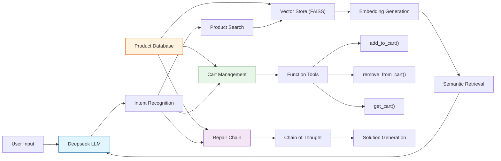

# PartSelect Chatbot - Intelligent Appliance Parts Assistant

## Overview
The PartSelect Chatbot is an intelligent assistant designed to help customers with refrigerator and dishwasher parts. It provides product information, installation guidance, troubleshooting assistance, and shopping support through natural language interactions.

## Key Features

### 1. Intelligent Product Search
- Vector-based semantic search using FAISS
- Product compatibility checking
- Detailed product information retrieval
- Installation guides and videos

### 2. Advanced Repair Diagnosis
- Chain of Thought (CoT) based fault analysis
- Multi-step diagnostic process
- Safety considerations and preventive measures
- Repair stories and solutions

### 3. Shopping Experience
- Shopping cart management
- Product comparison
- Price information
- Order assistance

### 4. Natural Language Understanding
- Context-aware responses
- Multi-turn conversations
- Domain-specific knowledge
- Error handling and fallback responses

## System Architecture



### Core Components

**API Gateway (FastAPI)**
- RESTful endpoints for chat and cart operations
- Request validation and error handling

**Chat Agent**
- Deepseek LLM integration
- Intent recognition and routing
- Context management
- Response generation

**Vector Store (FAISS)**
- Product information storage
- Semantic search capabilities
- Embedding management

**Repair Chain**
- Chain of Thought reasoning
- Fault diagnosis system
- Solution generation

**Cart Manager**
- Shopping cart operations
- Order management
- Price calculations

**Search Engine**
- Bing Web Search integration
- External knowledge retrieval
- Information enrichment

## Technical Implementation

### 1. Product Search and Recommendation System

**Implementation Overview**
The product search system is built on a hybrid architecture combining vector-based semantic search with structured product data:

```python
class VectorStore:
    def __init__(self, model_name: str = "all-MiniLM-L6-v2"):
        self.model = SentenceTransformer(model_name)
        self.index = None
        self.product_data = None

    def load_product_data(self, product_data: List[Dict]):
        # Convert product information into embeddings
        product_texts = [
            f"{p['name']} {p['description']} {p['model_compatibility']}"
            for p in product_data
        ]
        self.embeddings = self.model.encode(product_texts)
        self.index = faiss.IndexFlatL2(self.embeddings.shape[1])
        self.index.add(self.embeddings)
```

**Data Structure**
```python
@dataclass
class ProductInfo:
    part_number: str
    name: str
    description: str
    model_compatibility: List[str]
    installation_guide: str
    price: float
    product_url: str
    part_videos: List[str]
    repair_stories: List[str]
```

### 2. Shopping Cart Management

**Implementation Overview**
The Shopping Cart Management system integrates multiple advanced technologies:

```python
class ChatAgent:
    def __init__(self):
        self.system_prompt = """You are a helpful assistant for PartSelect.com. You can help with:
1. Adding items to cart: When user wants to add an item, use the add_to_cart function
2. Removing items from cart: When user wants to remove an item, use the remove_from_cart function
3. Viewing cart: When user wants to see their cart, use the get_cart function
4. Repair assistance: For repair questions, use the repair_chain
5. Product search: For product queries, use the vector_store"""

class CartManager:
    def add_to_cart(self, part_number: str, name: str, price: float) -> bool:
        try:
            self.cart.append(CartItem(
                part_number=part_number,
                name=name,
                price=price,
                quantity=1
            ))
            return True
        except Exception as e:
            self.logger.error(f"Error adding to cart: {str(e)}")
            return False
```

### 3. Repair Diagnosis Chain

**Implementation Overview**
The Repair Diagnosis Chain system implements a sophisticated approach to appliance repair diagnosis:

```python
def diagnose(self, appliance_type: str, problem_description: str) -> Dict:
    # Step 1: Initial Analysis
    problem_type = self._determine_problem_type(problem_description)
    
    # Step 2: Detailed Assessment
    initial_assessment = self._create_initial_assessment(
        appliance_type, 
        problem_description
    )
    
    # Step 3: Solution Development
    diagnosis_steps = self.problem_types[problem_type](
        appliance_type, 
        problem_description
    )
```

## Performance and Scalability

### Response Time
- Average response time: < 2 seconds
- Vector search latency: < 100ms
- Cart operations: < 50ms

### Scalability Features
- Horizontal Scaling: Stateless architecture
- Caching: Vector store caching
- Load Balancing: API gateway distribution
- Resource Optimization: Efficient memory usage

## Example Interactions

### 1. Product Information
```
User: Can you show me some refrigerator items?
Bot: Here are some refrigerator parts available:
    1. Refrigerator Door Shelf Bin (PS11752778) - $36.08
    2. Refrigerator Water Filter (PS11746285) - $49.99
```

### 2. Installation Guidance
```
User: How do I install the refrigerator door shelf bin?
Bot: Here's the installation guide:
    1. Turn off water supply
    2. Unplug refrigerator
    3. Remove old ice shelf
    4. Connect water line to new ice shelf
    5. Secure mounting bracket
    6. Plug in and test
```

### 3. Repair Diagnosis
```
User: My refrigerator is not cooling properly. What could be wrong?
Bot: Let me analyze the problem:
    1. Problem Type: Mechanical
    2. Initial Assessment:
       - Appliance: Refrigerator
       - Problem: Not cooling
       - Complexity: Medium
    3. Diagnosis Steps:
       - Check power supply
       - Inspect cooling system
       - Verify temperature control
```

### 4. Shopping Experience
```
User: Add the refrigerator door shelf bin to my cart
Bot: I've added the Refrigerator Door Shelf Bin (PS11752778) to your cart.
     Price: $36.08
     You can view your cart by saying 'show my cart'.
```

## System Design Highlights

### 1. Modular Architecture
- Independent components for different functionalities
- Easy to extend and maintain
- Clear separation of concerns

### 2. Intelligent Search
- Vector-based semantic search
- Context-aware results
- Product compatibility checking

### 3. Advanced Diagnosis
- Chain of Thought reasoning
- Multi-step problem analysis
- Safety considerations
- Preventive measures

### 4. Scalable Design
- Vector store for efficient search
- API-based architecture
- Easy integration with external services

## Future Enhancements

### Planned Improvements

**Enhanced RAG Implementation**
- Data Source Integration
- Chunk Optimization
  - Dynamic chunk sizing
  - Semantic chunking
- Vector Store Enhancement

**Multi-modal Support**
- Image Processing
- Voice Interaction
- Natural language processing

### Research Directions

**Fine-tuning Strategies**
- Model Optimization
  - Domain-specific fine-tuning
  - Task-specific adaptation
- Training Approaches
  - Few-shot learning
  - Transfer learning

## Conclusion
The PartSelect Chatbot demonstrates how AI and natural language processing can enhance the customer experience in the appliance parts industry. Its combination of intelligent search, advanced diagnosis, and seamless shopping experience provides a comprehensive solution for customers' needs. 